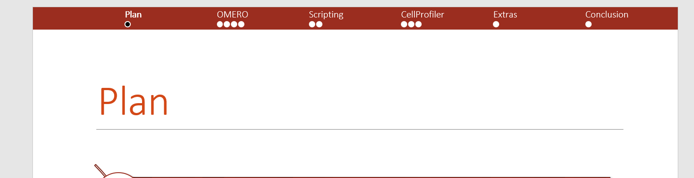
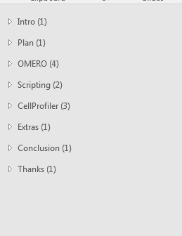

# ContextDots

INTRODUCTION
-------------------------

ContextDots is a Microsoft PowerPoint Macro that empowers people
to do better presentations. It features a "progress bar" at each slide's
top to show the global context (PPT calls it 'section') : the
advancement in this specific section, as well as the global progress
among all sections.

Inspired by Latex Beamer "Frankfurt", ContextDots is a port to Powerpoint.

ContextDots was written by Valentin Lungenstrass (vlstr) in VBA and is
currently available in version 1.0. This code snippet is Open Source
and can be used and shared by anybody.

Edited by Laurent Guerard (lguerard) to adapt to the theme used in the presentation
and avoid showing during the 1st and last sections.

INSTRUCTIONS
-------------------------

REQUIREMENTS
+ Microsoft Office 2007+ able to run Macros (Windows RT is not
compatible)
+ Use PowerPoint's "Section" feature to separate important parts
+ Keep space free (default is 25 points) at the top (or bottom) of the slide

HOW TO USE IT

1/ Create your presentation by using PowerPoint's "Section" feature to
partition your presentation

2/ At any time - mostly at the end - click the "View" tab and select
"Macros" on the very right

3/ Enter a name, e.g. "ContextDots", and select "Create"

4/ Then copy and paste the ContextDots code into the window,
overwriting default code lines

5/ To execute this Macro, press the little (green) "play" symbol in the
upper toolbar

6/ ContextDots should now be integrated into your PowerPoint
presentation

NB: If you change something to your slides and want to update the ContextDots bar,
simply select "View" -> "Macros" -> "ContextDots" -> "Execute"

REMOVE CONTEXTDOTS FROM PRESENTATION

To remove ContextDots from your slides, select "Edit" in "Macros" and
replace the code with the code in RemoveContextDots

PERSONALIZE CONTEXTDOTS
-------------------------

+ The macro is set up to use the 6th color of the theme of the presentation.
This can be changed by changing the number line 22.

If you look for a specific colour, you might want to look for your
colour's RGB values and write "RGB(r, g, b)" in the code

+ If you want to change the bullet shape, here is a list of possible
shapes:
https://msdn.microsoft.com/EN-US/library/office/ff862770.aspx

+ If you want to change the bullets' size, change line "BulletSize = 9"
according to your needs

+ If you want to have the bar at the bottom of your slide, use the other file named "ContextDots_atTheBottom". This will put the ContextDots bar at the bottom of your slide. Except the vertical positioning, no other change has been made to this file. All other customization options are still valid.

FAQ
-------------------------

- Can I keep the ContextDots Macro in my Microsoft PowerPoint Macro list? At this moment, there is no (easy) way to keep record of used PPT macros... 

